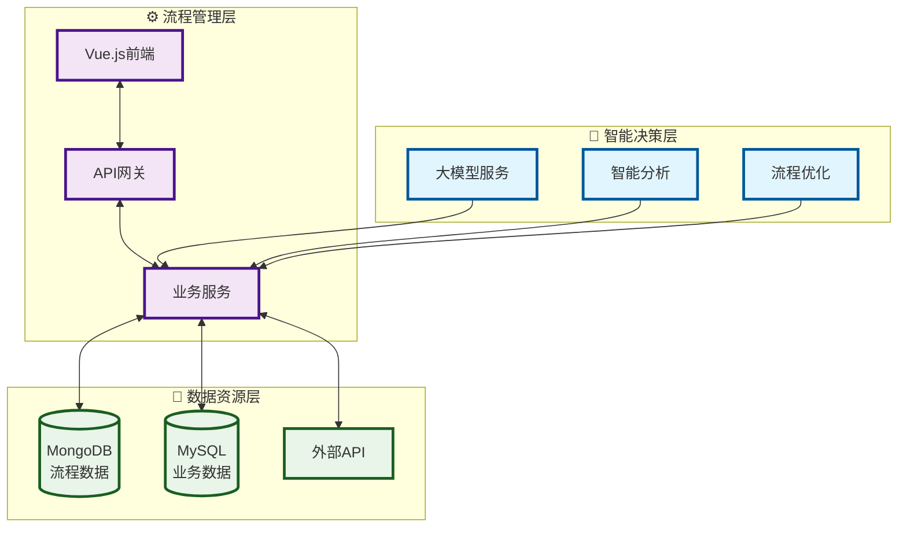

# DIPRO平台架构图

## 精简架构图

## 核心特点

### 🧠 智能决策层
- 大模型服务 (火山引擎API)
- 智能分析与流程优化

### ⚙️ 流程管理层  
- Vue.js前端界面
- Express API网关
- Node.js业务服务

### 💾 数据资源层
- MongoDB (流程数据)
- MySQL (业务数据) 
- 外部API接口

## 技术栈
- **前端**: Vue.js + Element UI
- **后端**: Node.js + Express  
- **数据库**: MongoDB + MySQL
- **AI服务**: 火山引擎API
